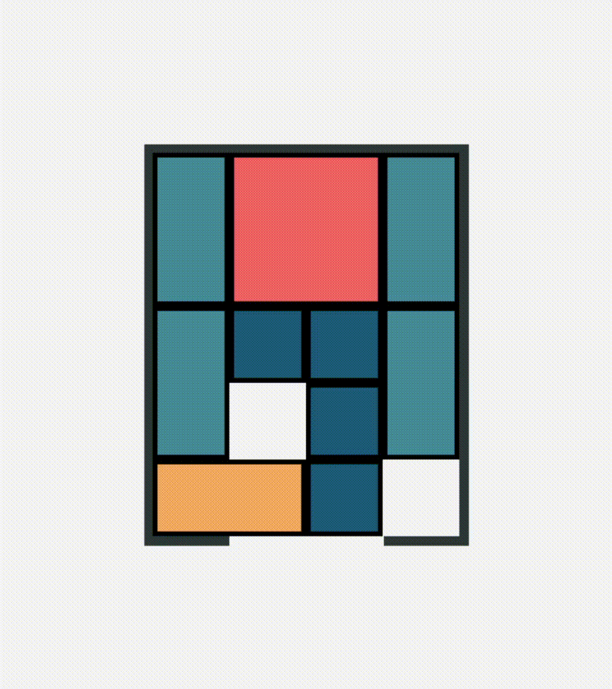
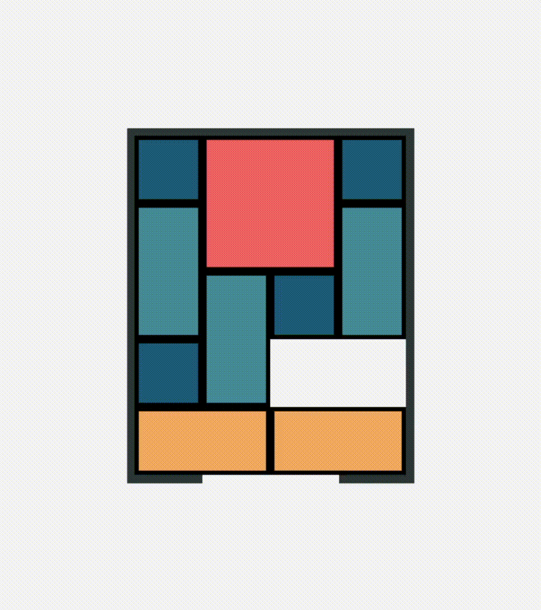

# Klotski Solver

A simple Klotski puzzle solver written naively. Works from any position.

Uses BFS to find the shortest path. Takes about 9 seconds
 
Also finds every single unique solution in a second more.

# Recursive Bruteforce Alternative

Uses bruteforce recursive backtracking, so it does not find the shortest path.

Takes 14025 moves to solve_recursive in 3-5 seconds. Just for fun :>
 
Maybe this can be improved?

Improved to 4886 moves in 0.3 seconds, after ignoring mirror positions

# Pygame Animation

An animation in pygame-ce for the shortest path solution
 
Takes 9 seconds to spin up while it calculates the shortest path

 
 
 

# Modify the Starting Position

Modify the json files in the boards folder.

Then change the selected json in main/main-animated

# TODO

- [x] Add a simpler way to modify the board without modifying the main files. Import from json, perhaps.
- [x] Fully implement Zobrist hashing (currently just works as a basic hash, but still somehow faster then the naive hash from before)
