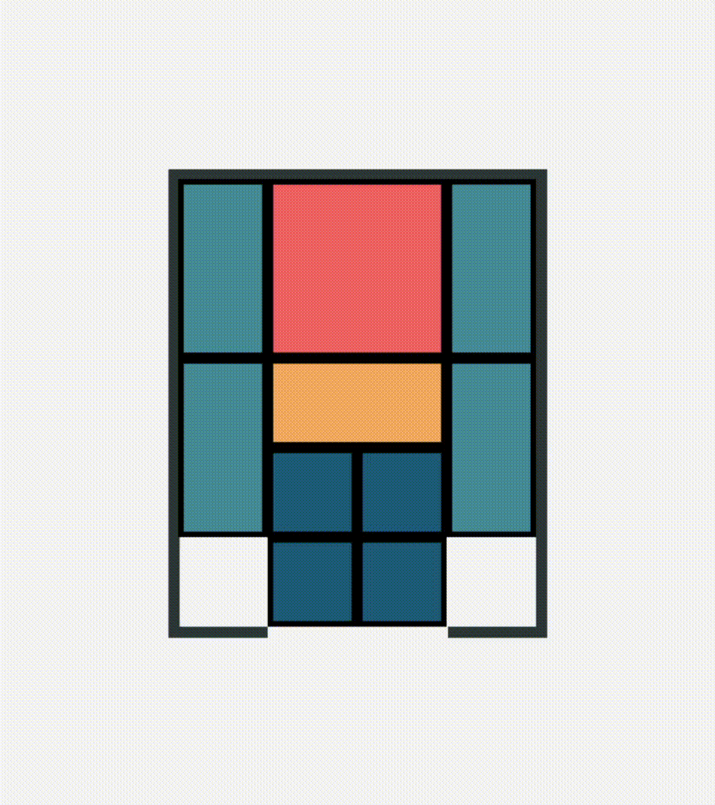

# Klotski Solver

A simple Klotski puzzle solver written naively. Works from any position.

Uses BFS to find the shortest path. Takes about 18-22 seconds (deepcopy overhead?)
 
Also finds every single unique solution in a couple seconds more.

# Recursive Bruteforce Alternative

Uses bruteforce recursive backtracking, so it does not find the shortest path.

Takes 14025 moves to solve_recursive in 3-5 seconds. Just for fun :>
 
Maybe this can be improved?

# Pygame Animation

An animation in pygame-ce for the shortest path solution
 
Takes 18-22 seconds to spin up while it calculates the shortest path

# Modify the Starting Position

Modify original_board in solver_files/Board.py to change the starting position

You will also have to modify original_board in pygame_files/Blocks.py if you want the animation to work

# TODO

- [ ] Add a simpler way to modify the board without modifying the main files. Import from json, perhaps.